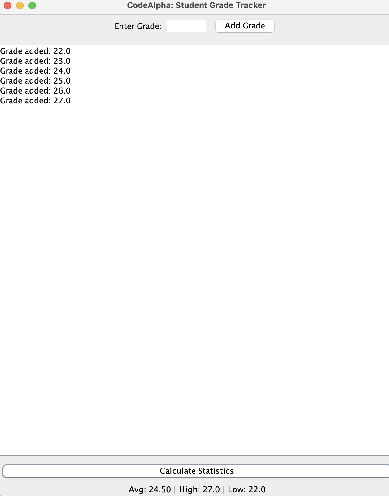

**Project Title** : Student Grade Tracker

**Domain** : Java Programming

**Description** : A GUI-based application to track and calculate student grades.

**Features** : Average calculation, identifying highest/lowest scores, and input validation.

## Project Description
A Java Swing-based desktop application designed to help teachers manage student grades. It allows for dynamic entry of scores and provides instant statistical analysis.

## Features
* **Interactive GUI:** Easy-to-use window interface built with Java Swing.
* **Data Management:** Uses `ArrayList` for dynamic storage of student scores.
* **Analysis:** Automatically calculates:
    * Average Score
    * Highest Score
    * Lowest Score
* **Validation:** Built-in error handling to prevent invalid inputs or empty calculations.

## Visual Preview

## How to Run
1. Ensure you have JDK installed.
2. Download `GradeTrackerGUI.java`.
3. Compile using: `javac GradeTrackerGUI.java`
4. Run using: `java GradeTrackerGUI`
